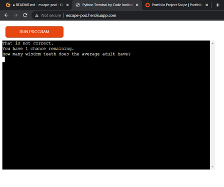
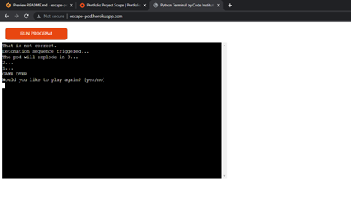
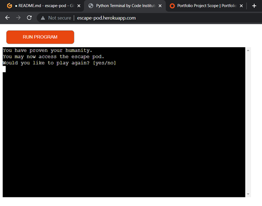
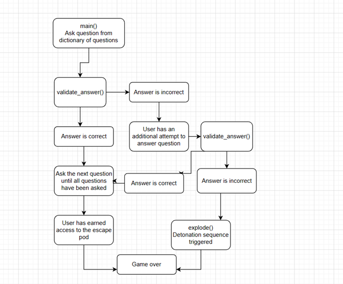
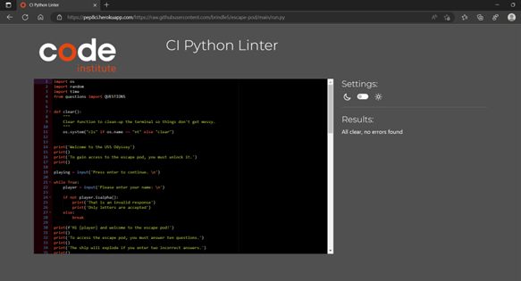
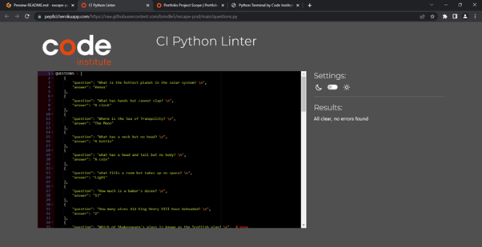
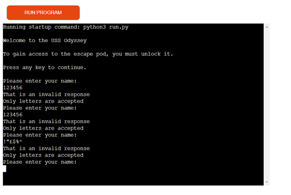

# **Escape Pod** #

‘Escape Pod’ is a terminal game where players need to answer a series of questions before they can access an escape pod. For each question, the player has two attempts to input the correct answer. If they fail to get the correct answer on the second attempt, it will trigger a destruction sequence and the game will end.

## **Features** ##

There are a number of features within the escape pod game:

- The dictionary of 30 questions and answers are shuffled and the first 10 of those are presented to the player. 
- The player is kept in a loop while they answer their 10 questions.
- The player's answer is checked within the 'validate answer' function. They are given a second chance if they submit an incorrect answer. 

- On submission of a second incorrect answer, the 'explode' function is triggered which ends the game.

- The game is replayable. At the end of the game, the user is asked whether they'd like to play again. This reduces the chance of the player being asked the same question.

### Future Features ###

The game could be easily expanded by adding further questions to the question and answer dictionary. 

## **Tools and Technologies** ##

I have used a variety of different tools to create the program:
- [Python](https://www.python.org) has been used as the back-end programming language.
- [Git](https://git-scm.com) has been used for version control. (`git add`, `git commit`, `git push`)
- [GitHub](https://github.com)  has been used for secure online code storage.
- [Gitpod](https://gitpod.io) has been used as a cloud-based IDE for development.
- [Markdown Builder by Tim Nelson](https://traveltimn.github.io/readme-builder) been used to help generate the Markdown files.
- [Heroku](https://www.heroku.com) has been used for hosting the deployed back-end site.

## **Data Model** ##

### Flow chart ###

A flow chart was created in order to organise the programme's logic using [Draw.io](https://www.draw.io). This shows the entire cycle of the programme.

### Functions ###

The primary functions used on this application are:
-   `clear()` - clears the screen after the introduction and each question.
-	`validate_answer()` - checks the user’s answer against the correct answer in the dictionary. If incorrect, it prompts for the user to resubmit.
-	`explode()` –  this ends the game if the user enters to incorrect answers.
-	`main()` - run all program functions.

### Imports ###

I've used the following Python packages and/or external imported packages:
- `time`: used for adding time delays.
- `random`: used to get a random choice from a list.
- `os`: sets environment variables
- `QUESTIONS`: imports the questions and answers from their separate file. 

## **Testing** ##

### Code Validation ###

I have used the recommended [CI Python Linter](https://pep8ci.herokuapp.com) to validate all of my Python files.

[Run.py validation link](https://pep8ci.herokuapp.com/https://raw.githubusercontent.com/brindle5/escape-pod/main/run.py)  

Result: pass with no errors

[Questions.py validator link](https://pep8ci.herokuapp.com/https://raw.githubusercontent.com/brindle5/escape-pod/main/questions.py)

Result: pass with no errors

### Defensive Programming ###

When the user is prompted to enter their name, the ‘isalpha ‘command is used to ensure only valid letters are accepted. If the user enters invalid characters, they will be prompted to enter their name again. The user cannot exit the loop without inputting valid characters.

### Bugs ###

There are no bugs that I'm aware of.

## **Deployment** ##

Code Institute has provided a [template](https://github.com/Code-Institute-Org/python-essentials-template) to display the terminal view of this backend application in a modern web browser.
This is to improve the accessibility of the project to others.
The live deployed application can be found deployed on [Heroku](https://escape-pod.herokuapp.com).
### Heroku Deployment
This project uses [Heroku](https://www.heroku.com), a platform as a service (PaaS) that enables developers to build, run, and operate applications entirely in the cloud.
Deployment steps are as follows, after account setup:
- Select **New** in the top-right corner of your Heroku Dashboard, and select **Create new app** from the dropdown menu.
- Your app name must be unique, and then choose a region closest to you (EU or USA), and finally, select **Create App**.
- From the new app **Settings**, click **Reveal Config Vars**, and set the value of KEY to `PORT`, and the value to `8000` then select *add*.
- If using any confidential credentials, such as CREDS.JSON, then these should be pasted in the Config Variables as well.
- Further down, to support dependencies, select **Add Buildpack**.
- The order of the buildpacks is important, select `Python` first, then `Node.js` second. (if they are not in this order, you can drag them to rearrange them)
For Heroku deployment, follow these steps to connect your own GitHub repository to the newly created app:
Either:
- Select **Automatic Deployment** from the Heroku app.
Or:
- In the Terminal/CLI, connect to Heroku using this command: `heroku login -i`
- Set the remote for Heroku: `heroku git:remote -a app_name` (replace *app_name* with your app name)
- After performing the standard Git `add`, `commit`, and `push` to GitHub, you can now type:
	- `git push heroku main`
The frontend terminal should now be connected and deployed to Heroku!
### Local Deployment
This project can be cloned or forked in order to make a local copy on your own system.
For either method, you will need to install any applicable packages found within the *requirements.txt* file.
- `pip3 install -r requirements.txt`.
If using any confidential credentials, such as `CREDS.json` or `env.py` data, these will need to be manually added to your own newly created project as well.
#### Cloning
You can clone the repository by following these steps:
1. Go to the [GitHub repository](https://github.com/brindle5/escape-pod) 
2. Locate the Code button above the list of files and click it 
3. Select if you prefer to clone using HTTPS, SSH, or GitHub CLI and click the copy button to copy the URL to your clipboard
4. Open Git Bash or Terminal
5. Change the current working directory to the one where you want the cloned directory
6. In your IDE Terminal, type the following command to clone my repository:
	- `git clone https://github.com/brindle5/escape-pod.git`
7. Press Enter to create your local clone.
Alternatively, if using Gitpod, you can click below to create your own workspace using this repository.

Please note that in order to directly open the project in Gitpod, you need to have the browser extension installed.
A tutorial on how to do that can be found [here](https://www.gitpod.io/docs/configure/user-settings/browser-extension).
#### Forking
By forking the GitHub Repository, we make a copy of the original repository on our GitHub account to view and/or make changes without affecting the original owner's repository.
You can fork this repository by using the following steps:
1. Log in to GitHub and locate the [GitHub Repository](https://github.com/brindle5/escape-pod)
2. At the top of the Repository (not top of page) just above the "Settings" Button on the menu, locate the "Fork" Button.
3. Once clicked, you should now have a copy of the original repository in your own GitHub account!

## **Credits** ##

### Content ###

* Code Institute for the deployment terminal in Heroku.

* [Markdown Builder by Tim Nelson](https://traveltimn.github.io/readme-builder)  README and TESTING tool to help generate the Markdown files
